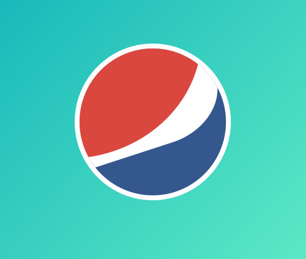
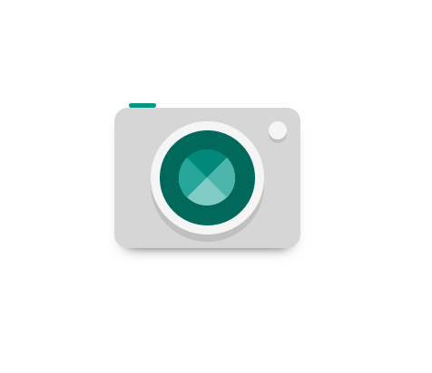
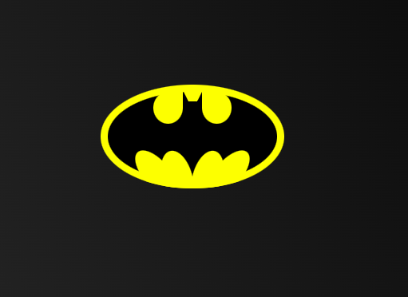
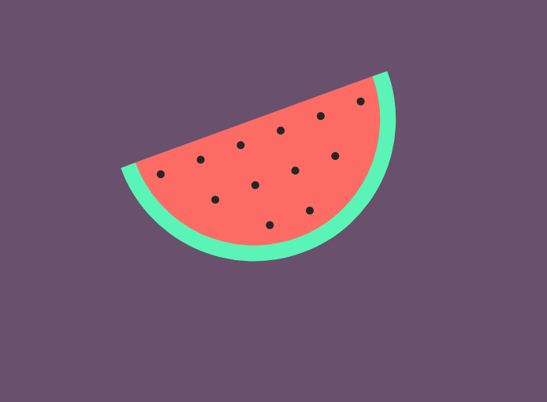
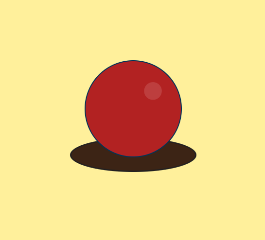
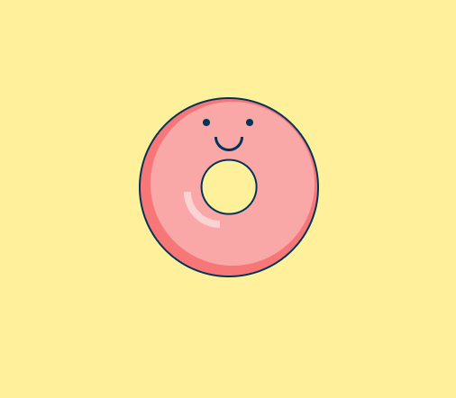
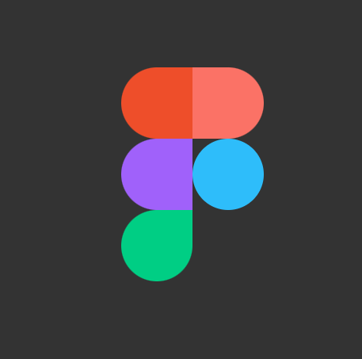
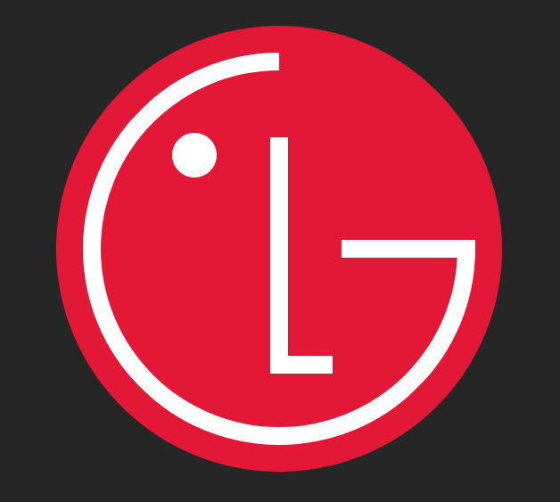
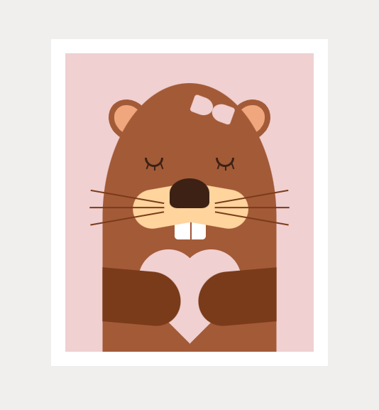

# CSS DRAWING

Drawings with pure CSS.

## Diamond 💎

- [Link](diamond)

## Envelope with CSS ✉ ❤

- [Link](envelope_with_heart)

## Pepsi

- [Link](pepsi_logo)

## Camera 🤳

- [Link](camera)

## Coffee mug ☕

- [Link](coffee_mug)

## Batman 🦇

- [Link](batman)

## Captain America´s shield

- [Link](captain_america)

## Gear ⚙

- [Link](gear)

## Git

- [Link](git_logo)

## Google

- [Link](google_logo)

## Instagram

- [Link](instagram)

## Panda 🐼

- [Link](panda)

## Watermelon 🍉

- [Link](watermelon)

## Adidas

- [Link](adidas)

## Brackets

- [Link](brackets)

## Ball 🏀

- [Link](ball)

## Dunut 🍩

- [Link](donut)

## Figma 

- [Link](figma)

## ReactJS 

- [Link](react)

## LG 

- [Link](lg)

## Beaver 🐾

- [Link](beaver)

## Bookshelf with clock and cactus ⏰📚🌵

- [Link](bookshelf_with_clock_and_cactus)

