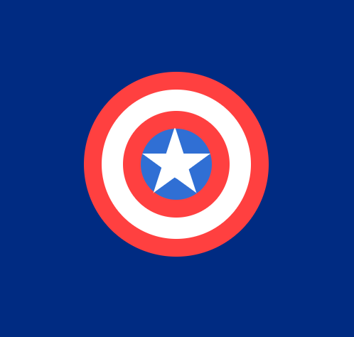
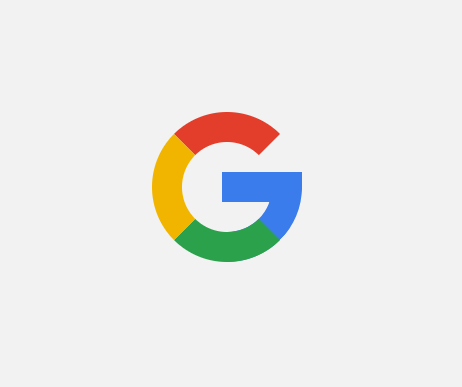

# CSS DRAWING

Drawings with pure CSS.

## Diamond

- [Link](diamond)

## Envelope with CSS

- [Link](envelope_with_heart)

## Pepsi

- [Link](pepsi_logo)

## Camera

- [Link](camera)

## Coffee mug

- [Link](coffee_mug)

## Batman

- [Link](batman)

## Captain America´s shield

- [Link](captain_america)

## Gear

- [Link](gear)

## Git

- [Link](git_logo)

## Google

- [Link](google_logo)

## Instagram

- [Link](instagram)

## Panda

- [Link](panda)

## Brackets

- [Link](brackets)

## Ball

- [Link](ball)

